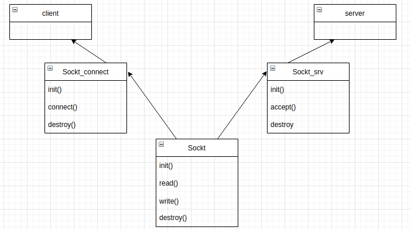

# tp1
Para este TP se usó c en su totalidad. Haciendo uso de sus structs se crearon 3 tipos de datos abstractos con sus respectivas funciones para simplificar y construir el trabajo por bloques. En el siguiente diagrama se muestra los tipo de datos abstractos usados y en donde son dependencia.

La primera parte del trabajo práctico que, se contruyó y se testeó, fue el TDA del ahorcado. Este comenzó simplemente como una palabra y la cantidad de intentos guardados en la estructura la cual mediante que se escribía el codigo se fueron agregando campos necesarios como el largo de la palabra, las letras reveladas actualmente.  Ambas palabras que se guardan en el dato yacen en el heap por lo cual cuenta con una función de destrucción. Finalmente éste cuenta con una función para probar un caracter a la vez, la cual devuelve si ha ganado o no, lo que va revelado de la palabra(y en el caso de perder la palabra entera) y la cantidad de intentos restantes. Por otro lado tanto el servidor como el cliente cuentan con su tipo de dato abstracto para simplificar la ultilización de los sockets. Ambos datos son similares pero la gran diferencia entre estos es que el del servidor cuenta con logica y funciones adicionales para manejar la cola de clientes. Esto es mediante la función accept por la que el servidor puede cortar la comunicación con el cliente actual y iniciarla con uno nuevo. Ambos cuentan con una función de destrucción para cerrar sus correspondientes file_descriptors.
